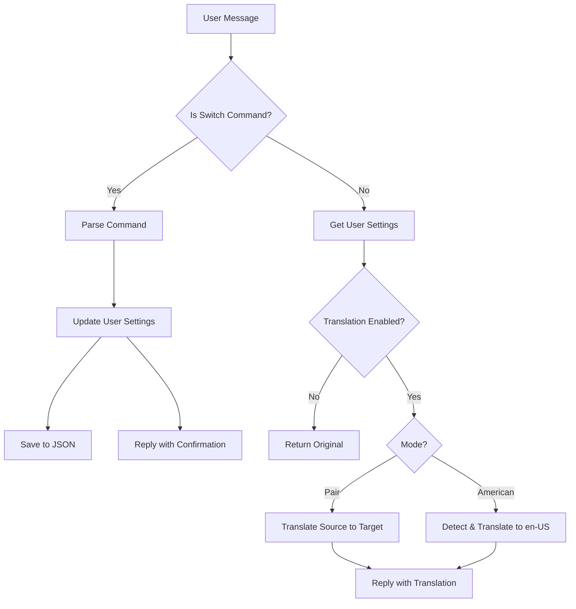

#Switch Command Feature Implementation

## Overview

Add command-based controls for translation behavior in the LINE bot. Users can toggle translation, set language pairs, or use American English mode. Settings are stored per-user in a JSON file.

## Architecture




## Files to Modify

### 1. `line_translator_bot.py`

- Add command parsing logic to detect switch commands (starting with `/on`, `/off`, `/set`, `/status`)
- Extract user ID from LINE event (`event.source.user_id`)
- Load/save user settings from JSON file
- Route commands to appropriate handlers
- Modify translation logic to respect user settings

### 2. `gcs_translate.py`

- Update `detect_and_translate()` to accept optional parameters:
- `enabled`: boolean
- `source_lang`: optional source language code
- `target_lang`: target language code
- `mode`: "pair" or "american"
- Add language code mapping function (eng→en, tc→zh-TW, jpn→ja, th→th, ind→id)
- Implement American English mode (detect any language → translate to en-US)

## Implementation Details

### Command Parsing

- Commands start with `/` and are case-insensitive
- `/on translate` - enables translation for user
- `/off translate` - disables translation for user
- `/set language pair <source> <target>` - sets specific language pair (e.g., `/set language pair tc eng`)
- `/set american` - sets mode to translate all languages to American English
- `/status` - returns current user settings

### User Settings Structure

```json
{
  "user_id_1": {
    "enabled": true,
    "mode": "pair",  // or "american"
    "source_lang": "zh-TW",
    "target_lang": "en"
  },
  "user_id_2": {
    "enabled": false,
    "mode": "american",
    "source_lang": null,
    "target_lang": "en-US"
  }
}
```


### Language Code Mapping

- `eng` → `en` (English)
- `tc` → `zh-TW` (Traditional Chinese)
- `jpn` → `ja` (Japanese)
- `th` → `th` (Thai)
- `ind` → `id` (Indonesian)

### Default Behavior

- New users: translation disabled by default
- If translation is disabled, return original message without translation
- If enabled but no language pair set, use default (detect → translate to English)

### Error Handling

- Invalid language codes → reply with error message and supported languages
- Malformed commands → reply with usage instructions
- JSON file read/write errors → log and continue with default settings

## File Changes Summary